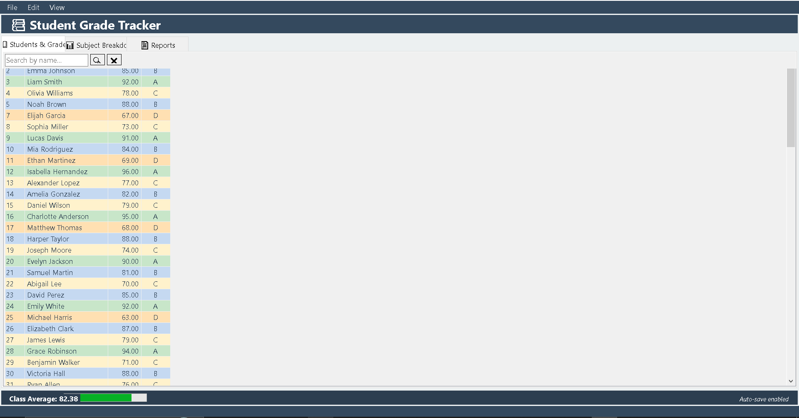

# 📚 Student Grade Tracker

A Windows Forms desktop application for managing student grades, subjects, and generating reports. Features encrypted JSON storage, CSV import/export, auto-save, and a rich UI with grade color coding.


> **Demo Video**  
> [▶️ Watch on YouTube](https://www.youtube.com/watch?v=your-video-id)  


---

## ✨ Features

- **Student Management** – Add, edit, delete students and their grades per subject.
- **Grade Calculation** – Automatic average and letter grade (A–F) based on 0–100 scale.
- **CSV Import/Export** – Bulk add students via CSV (Student Name, Subject, Grade). Export all data for backup or analysis.
- **Encrypted Storage** – Student data is saved in `students.json` encrypted with AES‑256 (key/IV from `appsettings.json`).
- **Auto‑Save** – Saves changes every 30 seconds (toggle on/off from View menu).
- **Filter & Sort** – Search students by name, sort by ID, name, average, or letter grade.
- **Subject Breakdown** – Tree view showing subjects and individual grades per student.
- **Reports** – Tabular report with customizable font and copy‑able text.
- **Grade Colors** – Customize background colors for each letter grade.
- **System Tray Notifications** – Auto‑save notifications.

---

## 📸 Screenshot




---

## 🚀 Getting Started

### Prerequisites

- [.NET 10.0 SDK](https://dotnet.microsoft.com/en-us/download) (or later)
- Windows OS (WinForms)

### Installation

1. Clone the repository:
   ```bash
   git clone https://github.com/yourusername/student-grade-tracker.git
   cd student-grade-tracker